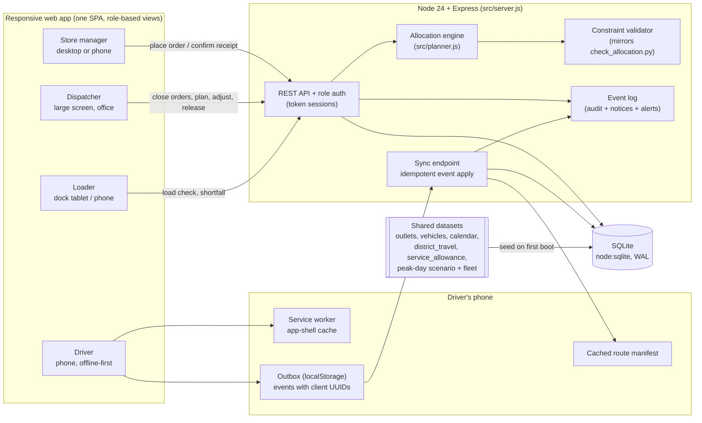

# Architecture

## Main flow

1. **Order**: the store manager places dry or chilled orders. The server confirms them at once with a reference. After the dispatcher closes the run, new orders go to the next operating day (from `calendar.csv`).
2. **Close orders**: the dispatcher freezes the queue for the run.
3. **Plan**: `planner.plan()` ranks orders by priority (outlet skipped last run, then days since last served, perishability, value). It places each order greedily: first into an open trip for the same depot, brand and district (best fit), then onto the cheapest compatible free vehicle (keeping reefers for chilled goods and vans for van-only outlets). Every placement is checked against weight, volume, the two-trip limit, the pre-dawn 270-minute and daytime 480-minute windows, outlet and mall delivery windows, and the remaining weekly fuel quota. Orders that cannot be placed are deferred, and the binding constraint is recorded as the reason.
4. **Validate**: `planner.validate()` re-checks the whole allocation independently. It follows the same rules as the organisers' `check_allocation.py`, plus windows and fuel. A plan cannot be released while the check fails. Manual dispatcher changes (defer with reason, or assign a deferred order to a trip or vehicle) are simulated and validated before they are written.
5. **Release**: stores get an ETA or a deferral notice with the reason and the next run date. Loaders see their depot's trips.
6. **Load**: the loader sees orders in reverse stop sequence and marks each one loaded, short or missing. Shortfalls alert the dispatcher and the store before departure.
7. **Deliver**: the driver's phone keeps the route manifest and an outbox. Each action (depart, arrive, complete with POD name, signature, photo and units) becomes an event with a client-generated UUID and a client timestamp. When there is signal the outbox syncs. Replays come back as `duplicate`. Events that conflict with server state (a stop already recorded, or a trip reassigned) are `rejected`; the driver sees them, and the dispatcher gets a `sync_conflict` alert.
8. **Receipt**: the store sees the POD and confirms receipt or reports an issue (short, damaged, wrong, temperature). The issue appears in the dispatcher's "Needs attention" panel.

## Why this shape

- **One deployable, one container.** The judges' `docker compose up` gives the full stack, and the deployment stays simple on a free tier. SQLite (built into Node 24) is the database; the file sits on a named volume.
- **Planner as pure functions.** The engine has no database access, so it is unit-tested against the peak-day scenario (`npm test`). Its output passes the official `check_allocation.py`.
- **Event log as the single audit trail.** Deferrals, shortfalls, PODs, sync conflicts and receipts all land in `events`. The same table drives store notices, the dispatcher's alerts and the idempotency of offline sync.
