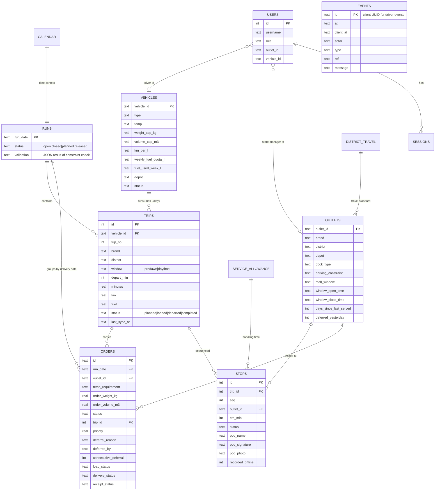

# Data model

## Notes

- **Reference tables** (`outlets`, `vehicles`, `district_travel`, `service_allowance`, `calendar`) are loaded unchanged from the shared datasets. `vehicles.status` comes from `task2b_peak_day_fleet.csv` (`available` / `in_workshop`; vehicles not listed are `off_roster`). `fuel_used_week_l` is seeded deterministically to represent Monday to Wednesday consumption.
- **Seed day**: Thursday 2026-04-30 (payday, Vesak festival ramp 0.9, monsoon). The orders are the 85 orders from `task2b_peak_day_scenarios.csv`. The demo store's own two orders are left out so the judge places them in step 1. `deferred_yesterday` and `days_since_last_served` sit on the outlet and feed the priority score.
- **events** is append-only. Driver events use the client's UUID as the primary key, so retrying a sync can never apply the same delivery twice.
- **Time** is stored as minutes after midnight for planning (`depart_min`, `eta_min`) and as ISO timestamps for what actually happened.
